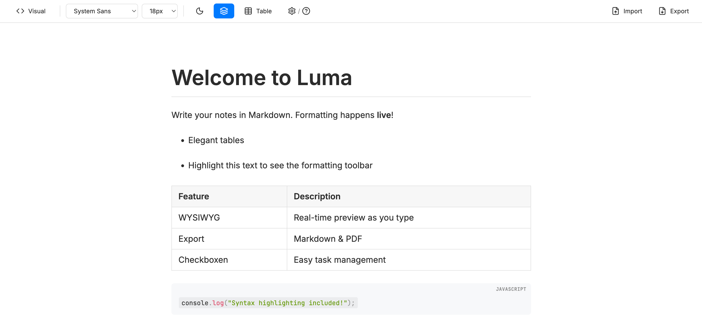

# Luma – Minimalist WYSIWYG Markdown Editor

Luma ist eine moderne, minimalistische Web-App für das Schreiben von Notizen in Markdown, stark inspiriert von Editoren wie Typora. Das Kernkonzept ist "Live Formatting": Der Nutzer schreibt reines Markdown, das sofort während des Tippens visuell formatiert wird, ohne dass ein geteilter Bildschirm nötig ist. Luma kombiniert die Einfachheit von Text-Dateien mit dem Komfort einer Textverarbeitung.

## Features

### Haupt-Features
*   **Live WYSIWYG Editing:** Markdown wird sofort beim Tippen gerendert (Überschriften, Listen, Tabellen etc.).
*   **Visual/Source Toggle:** Ein nahtloser Wechsel zwischen der formatierten Ansicht und dem Markdown-Quelltext über einen dedizierten Modus-Button mit fixer Breite für maximale Layout-Stabilität.
*   **Flyover-Toolbar:** Eine kontextuelle Formatierungsleiste mit Lucide-Icons, die bei Textmarkierung erscheint und gängige Formatierungen (Fett, Kursiv, Link, Listen etc.) per Klick erlaubt.
*   **Grafischer Tabellen-Dialog:** Ein Popover zum komfortablen Einfügen von Tabellen mit wählbarer Zeilen-/Spaltenanzahl und Überschrift-Option.
*   **GFM Erweiterungen:** Volle Unterstützung für GitHub Flavored Markdown inklusive Tabellen, Autolinks und Fußnoten.
*   **Export-Optionen:** Dokumente können als Standard-Markdown-Datei (.md) oder als formatiertes PDF (.pdf) exportiert werden.

### Quality-of-Life Features
*   **Auto-Save & Persistence:** Alle Notizen und Einstellungen (Theme, Schriftart, Sprache, Tabellen-Dichte) werden automatisch im Local Storage gespeichert.
*   **Mehrsprachigkeit:** Volle Unterstützung für Deutsch und Englisch, inklusive automatischer Erkennung des Browser-Standards und manueller Umschaltmöglichkeit.
*   **Anpassbare Typografie:** Auswahl zwischen verschiedenen Schrift-Stilen (Sans, Serif, Elegant, Mono) und Größen direkt in der Menüleiste.
*   **Dark Mode:** Ein integriertes dunkles Theme für angenehmes Schreiben.
*   **Hilfe & Einstellungen:** Ein kombiniertes Popover für Markdown-Syntax-Hilfe und Spracheinstellungen.
*   **Variable Tabellen-Dichte:** Die Zeilenhöhe von Tabellen lässt sich feinstufig (S, M, L, XL) anpassen, wobei "S" eine extrem kompakte Darstellung bietet.

## Technischer Aufbau

Luma basiert auf einem modernen Web-Stack:

*   **Framework:** [React 19](https://react.dev/) mit [TypeScript](https://www.typescriptlang.org/).
*   **Build-Tool:** [Vite](https://vitejs.dev/).
*   **Editor-Engine:** [Milkdown](https://milkdown.dev/) (Prosemirror-basiert).
    *   Genutzte Plugins: GFM, Commonmark, Prism (Highlighting), Tooltip (Flyover), Slash-Menu, History, Listener.
*   **Icons:** [Lucide React](https://lucide.dev/).
*   **Styling:** **Vanilla CSS** mit CSS-Variablen.
*   **PDF-Generierung:** [html2pdf.js](https://ekoopmans.github.io/html2pdf.js/).

## LLM-Handoff & Projekt-Kontext

Für zukünftige Entwicklungen oder Erweiterungen durch ein LLM sind hier wichtige interne Details dokumentiert:

*   **Editor-Synchronisation:** Die App nutzt einen `editorKey` in `App.tsx`, um den Editor bei externen Inhaltsänderungen (wie dem Einfügen von Tabellen) neu zu laden ("Hidden Reload"). Dies umgeht Synchronisationsprobleme bei unkontrollierten Komponenten.
*   **Milkdown v7 Integration:** Befehle werden über `commandsCtx.call()` innerhalb von `editor.action` ausgeführt.
*   **Tabellen-Handling:** Da das offizielle Table-Plugin in dieser Umgebung inkompatibel war, werden Tabellen als Markdown-Strings generiert und in den State injiziert. Die Zell-Padding-Werte werden über die CSS-Variable `--table-padding` gesteuert.
*   **Flyover Toolbar:** Der `TooltipProvider` prüft aktiv auf Textinhalt (`doc.textBetween`), um nicht auf leeren Zeilen zu erscheinen. Die Icons sind als Inline-SVGs in `Editor.tsx` definiert.
*   **Lokalisierung:** Zentral verwaltet über das `translations`-Objekt. Der `langSetting`-Status unterstützt `auto`, `de` und `en`.

## Erstellt mit
*   **Tool:** Gemini CLI
*   **Agent/Model:** Gemini 3
*   **Datum:** März 2026
